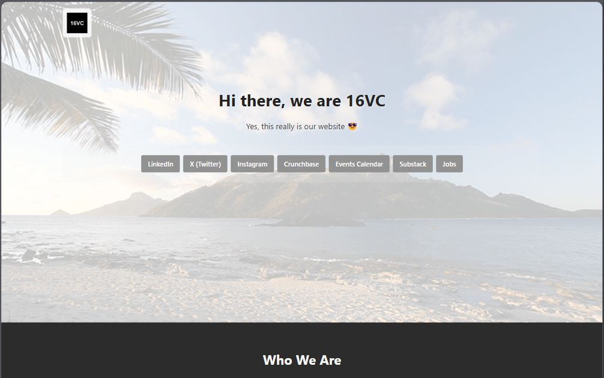

# **16VC Landing Page**
This is a responsive landing page for **16VC**, a venture capital firm focused on technology and AI startups. The application was developed with **ReactJS** and uses **modularized CSS** for styling, following the best front-end development practices. Let's become a unicorn?! :D

https://16vc-tdiascontatos-projects.vercel.app/



---

## **Features**

- **Responsive Design:** Adapts perfectly to any device (desktop, tablet, mobile).
- **Modular Componentization:** Code is organized into reusable components.
- **Scoped Styles:** Modularized CSS to avoid style conflicts.
- **Dynamic Content:** Easy content updates via React components.
- **Optimized Performance:** Fast and efficient loading.

---

## **Project Structure**

```
16vc-landing/
├── public/                  # Static files
│   └── logo.png             # 16VC logo
│   └── bg_header.gif        # Header background GIF
├── src/
│   ├── components/          # React Components
│   │   ├── Header/          # Page header
│   │   ├── Footer/          # Page footer
│   │   ├── Hero/            # Initial section
│   │   ├── Section/         # Base component for sections
|   |   |── Sections/
│   │       ├── WhoWeAre/        # "Who We Are" section
|   │       ├── HelpFounders/    # "16VC Helps Founders" section
|   │       ├── Fellowship/      # "16VC Fellowship" section
|   │       ├── MeetTeam/        # "16VC Member Team" section
|   │       └── Accelerator/     # "16VC Accelerator" section
│   ├── App.jsx              # Main component
│   ├── main.jsx             # Application entry point
│   └── index.css            # Global styles
├── .gitignore               # Ignore unnecessary files in Git
├── index.html               # HTML template
├── package.json             # Dependencies and scripts
├── vite.config.js           # Vite configuration
└── README.md                # This file
```

---

## **Technologies Used**

- **ReactJS**: JavaScript library for building user interfaces.
- **Vite**: Fast and modern build tool.
- **CSS Modules**: Scoped and modularized styles.
- **HTML5**: Semantic page structure.
- **Git**: Version control.

---

## **How to Run the Project**

### **Prerequisites**

- Node.js (v16 or higher)
- npm or yarn

### **Steps**

1. Clone the repository:
   ```bash
   git clone https://github.com/tdiascontato/16vc-landing.git
   ```

2. Navigate to the project folder:
   ```bash
   cd 16vc-landing
   ```

3. Install dependencies:
   ```bash
   npm install
   ```

4. Start the development server:
   ```bash
   npm run dev
   ```

5. Open in the browser:
   ```
   http://localhost:5173
   ```

---

## **Available Scripts**

- **`npm run dev`**: Starts the development server.
- **`npm run build`**: Generates the production version in the `dist` folder.
- **`npm run preview`**: Serves the production version locally.
- **`npm run test`**: Runs tests (if any).

---

## **Customization**

### **Change Content**

- Edit `.jsx` files in the `src/components/` folder to modify content.
- Update the `public/logo.png` file to change the logo.
- Replace `public/bg_header.gif` to change the background GIF.

### **Change Styles**

- Styles are organized in `.module.css` files within each component.
- For global styles, edit the `src/index.css` file.

---

## **Deployment**

To see the deployed application:

- **Vercel**: [https://16vc-tdiascontatos-projects.vercel.app/](https://16vc-tdiascontatos-projects.vercel.app/)

---

## **License**

This project is licensed under the MIT license. See the [LICENSE](LICENSE) file for more details.

---

## **Contact**

- **Developer**: Tiago Dias
- **Email**: tdiascontato@gmail.com
- **LinkedIn**: [https://linkedin.com/in/tdiascontato](https://linkedin.com/in/tdiascontato)

---

This project is simple but covers all essential aspects and was created with attention and importance 🚀